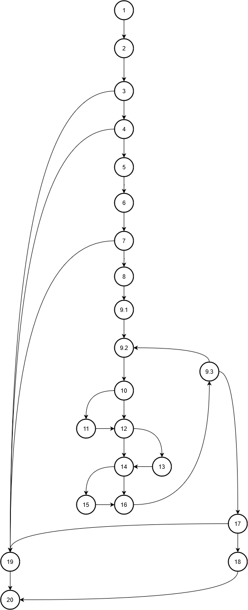

# SI_lab2_175052

Група на код:
Ја добив групата на код 5

Control Flow Graph:

Цикломатска комплексност

Цикломатската комплексност на овој код е 8.
предикатни јазли: 7
па 7 + 1 = 8.
исто како:
edges - nodes + 2P 
каде 
P = 1,
edges = 29,
nodes = 23.

29 - 23  + 2 = 8.

 Тест случаи според критериумот Every statement
....
Тест случаи според критериумот Every path
....
Објаснување на напишаните unit tests
... ...
