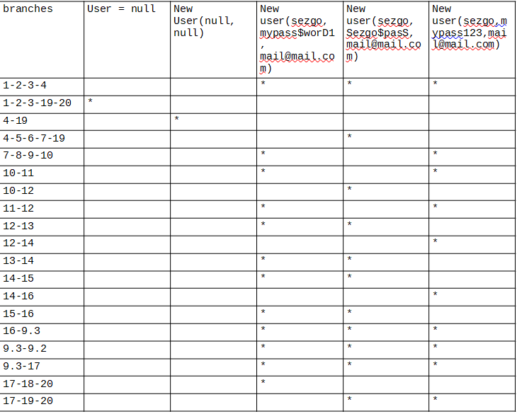

### Втора лабораториска вежба по Софтверско инженерство
---
## Сезѓин Мустафа, бр. на индекс 175052
---
# Група на код:  
Ја добив групата на код 4

# Control Flow Graph:  

  

# Цикломатска комплексност  

Цикломатската комплексност на овој код е 8.  
предикатни јазли: 7  
па 7 + 1 = 8.  
исто како:  
edges - nodes + 2P  
каде  
P = 1,  
edges = 29,  
nodes = 23.  

29 - 23  + 2 = 8.  

# Тест случаи според критериумот Every statement  
user = null goes through 1-2-3--19-20  
and  
User user = new User(sezgo, my$passworD1, mymail@mail.com)  
goes through every statement except 19 which was covered with the first test case.  

....  
# Тест случаи според критериумот Every path  
In order to cover all branches we need 5 test cases: an uninitialized user, an user that's initialized with null username, password and mail, a user with a password that has digit, upper case letter and special character in it, a user with a password that has upper case letter and special character but no digits in it, a user with a password that has digits but no upper case and no special character in it.

 

....  
# Објаснување на напишаните unit tests  

The first test case of every statement is expected to be false since it will go through 1-2-3-19-20
and the second is expected to be true since the password is as it is expected according to the conditions.

Within the function for testing every branc test cases, only the third test case is expected to be true because it is the only one that has the user with expected password while the other 4 are false. First of those for is false because the user is null and from third node it goes directly to 19 and 20 while the second one goes from 4th node to 19-20 because it was provided with a user with null username, null password and null email. The fourth fails because it has a password that has no digit. The fifth fails because it has a password that has no special character.
